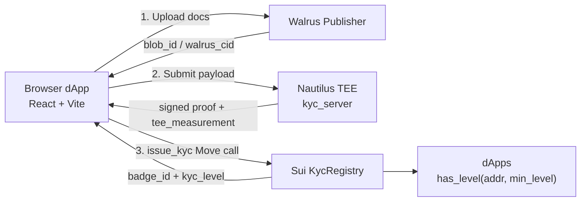
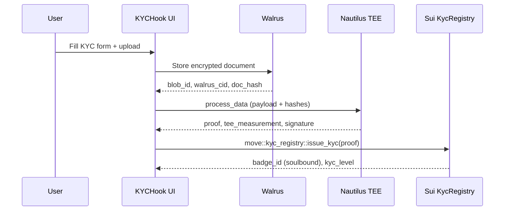

# KYCHook – Provable KYC for the Sui Ecosystem


Privacy-preserving KYC with Walrus storage, Nautilus TEEs, and on-chain Sui attestations (soulbound badges).

---

## System Overview

### High-level architecture



### Verification flow (happy path)



Key contracts (see `move/kychook`):
- `kyc_registry.move`: issues KYC credentials and exposes `get_kyc_status` / `has_level`.
- `provider_registry.move`: manages trusted providers.
- `kyc_badge.move`: soulbound badge representation.

---

## Repository Layout

- `src/` – React + TypeScript SPA (Vite).
- `move/kychook/` – Sui Move package (registry, provider, badge modules).
- `nautilus/` – Rust Nautilus TEE service (kyc_server) and tooling.
- `public/` – Static assets and optional `_redirects`/`_headers` for deploy.
- Docs: `ARCHITECTURE.md`, `DESIGN.md`, `PROJECT.md`, `UX.md`, `COMPLETE_INTEGRATION_GUIDE.md`, `NAUTILUS_REAL_DEPLOYMENT.md`.

---

## Setup & Commands

From `KYCHook/`:

```bash
npm install
npm run dev           # Vite dev server
npm run build         # Type-check + production build
npm run preview       # Serve built bundle locally
npm run lint          # ESLint
```

Move package:
```bash
cd move/kychook
sui move build
sui move test          # if/when tests are added
```

---

## Environment Variables

Create `.env` in `KYCHook/`:
```bash
# On-chain IDs (testnet or mainnet)
VITE_KYCHOOK_PACKAGE_ID=0x...
VITE_PROVIDER_REGISTRY_ID=0x...
VITE_KYC_REGISTRY_ID=0x...
VITE_KYCHOOK_UPGRADE_CAP=0x...

# Integrations
VITE_WALRUS_PUBLISHER_URL=https://publisher.walrus-testnet.walrus.space
VITE_WALRUS_AGGREGATOR_URL=https://aggregator.walrus-testnet.walrus.space
VITE_NAUTILUS_BASE_URL=http://localhost:3000
```

The app will throw helpful errors if a required var is missing (`src/config/onchain.ts`, `src/config/integrations.ts`).

---

## Deploy (Cloudflare Pages)

1. Push this repo to GitHub/GitLab/Bitbucket.
2. Cloudflare Pages → Create project → connect repo.
   - Build command: `npm run build`
   - Output directory: `dist`
   - Framework preset: Vite
3. Add env vars above to Pages (Production + Preview).
4. (Optional) `public/_redirects` for SPA fallback:
   ```
   /* /index.html 200
   ```
5. Custom domain: add via Pages → Custom domains (CNAME to `*.pages.dev`).

---

## How it works (concise)

1) User uploads encrypted doc → Walrus returns `blob_id`, `walrus_cid`, `doc_hash`.  
2) UI calls Nautilus TEE (`process_data`) with hashes + metadata; TEE signs proof and exposes `tee_measurement`.  
3) UI submits proof to Sui `kyc_registry::issue_kyc`; registry mints soulbound badge and stores status.  
4) Any dApp can gate with `kyc_registry::has_level(address, min_level)` using on-chain data only.

---

## Contributing / Verification

- Run `npm run lint` before committing.
- For on-chain changes, keep `ARCHITECTURE.md` and `PROJECT.md` in sync.
- Move modules live in `move/kychook`; update IDs in `.env` after publishing.

License: MIT
