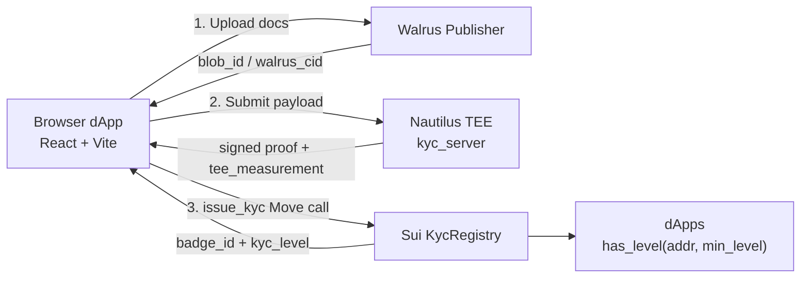
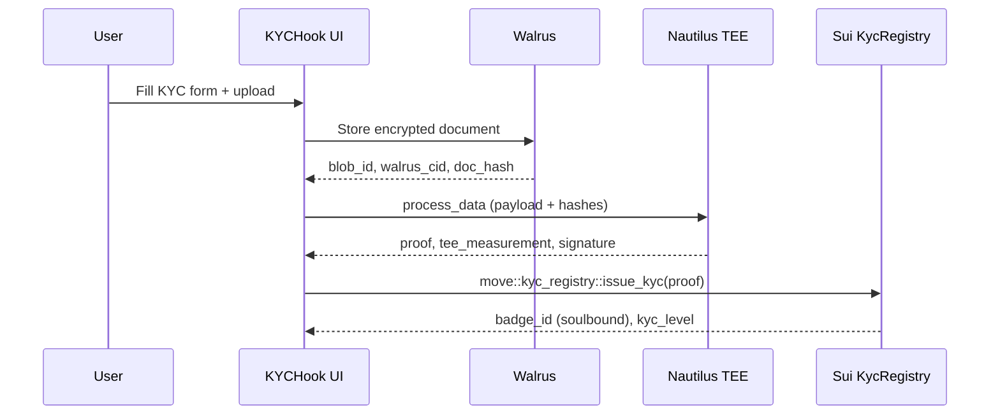

# KYCHook – Provable KYC for the Sui Ecosystem


Privacy-preserving KYC with Walrus storage, Nautilus TEEs, and on-chain Sui attestations (soulbound badges).

---

## System Overview

### High-level architecture



### Verification flow (happy path)



Key contracts (see `move/kychook`):
- `kyc_registry.move`: issues KYC credentials and exposes `get_kyc_status` / `has_level`.
- `provider_registry.move`: manages trusted providers.
- `kyc_badge.move`: soulbound badge representation.

---

## Repository Layout

- `src/` – React + TypeScript SPA (Vite).
- `move/kychook/` – Sui Move package (registry, provider, badge modules).
- `nautilus/` – Rust Nautilus TEE service (kyc_server) and tooling.
- `public/` – Static assets and optional `_redirects`/`_headers` for deploy.
- Docs: `ARCHITECTURE.md`, `DESIGN.md`, `PROJECT.md`, `UX.md`, `COMPLETE_INTEGRATION_GUIDE.md`, `NAUTILUS_REAL_DEPLOYMENT.md`.

---

## Setup & Commands

From `KYCHook/`:

```bash
npm install
npm run dev           # Vite dev server
npm run build         # Type-check + production build
npm run preview       # Serve built bundle locally
npm run lint          # ESLint
```

Move package:
```bash
cd move/kychook
sui move build
sui move test          # if/when tests are added
```

---

## Environment Variables

Create `.env` in `KYCHook/`:
```bash
# On-chain IDs (testnet or mainnet)
VITE_KYCHOOK_PACKAGE_ID=0x...
VITE_PROVIDER_REGISTRY_ID=0x...
VITE_KYC_REGISTRY_ID=0x...
VITE_KYCHOOK_UPGRADE_CAP=0x...

# Integrations
VITE_WALRUS_PUBLISHER_URL=https://publisher.walrus-testnet.walrus.space
VITE_WALRUS_AGGREGATOR_URL=https://aggregator.walrus-testnet.walrus.space
VITE_NAUTILUS_BASE_URL=http://localhost:3000
```

The app will throw helpful errors if a required var is missing (`src/config/onchain.ts`, `src/config/integrations.ts`).

---

## Walrus & Nautilus Notes

- Walrus: documents are stored via `VITE_WALRUS_PUBLISHER_URL`, and retrieved via `VITE_WALRUS_AGGREGATOR_URL`. The UI exposes blob_id / walrus_cid and doc_hash so auditors can cross-check custody.
- Nautilus: `VITE_NAUTILUS_BASE_URL` points to the kyc_server enclave. The `process_data` call returns a signed proof and `tee_measurement`; `issue_kyc` consumes this proof on-chain.
- Hash anchoring: only `doc_hash`, `walrus_cid`, and badge metadata are placed on-chain—no PII leaves the enclave.

---

## Deploy Nautilus on AWS Nitro Enclaves

1) **AWS prerequisites**
   - Set region/AMI and AWS credentials:
     ```bash
     export REGION=<aws-region>
     export AMI_ID=<amazon-linux-ami>
     export KEY_PAIR=<ec2-keypair>
     export AWS_ACCESS_KEY_ID=...
     export AWS_SECRET_ACCESS_KEY=...
     export AWS_SESSION_TOKEN=...    # if using STS
     ```

2) **Provision enclave host**
   ```bash
   cd nautilus
   sh configure_enclave.sh          # installs Nitro prerequisites and prepares the host
   ```

3) **Build & run the enclave**
   ```bash
   make && make run                 # builds enclave image and launches it
   sh expose_enclave.sh             # forwards enclave HTTP port to host
   # enclave endpoint: http://<host-public-ip>:3000
   ```

4) **Register enclave on Sui**
   ```bash
   sui client switch --env testnet
   sui client faucet
   cd move/kychook
   sui move build
   sui client publish
   # record ENCLAVE_PACKAGE_ID, CAP_OBJECT_ID, ENCLAVE_CONFIG_OBJECT_ID, EXAMPLES_PACKAGE_ID
   make && cat out/nitro.pcrs       # get PCR0/1/2
   sui client call --function update_pcrs --module enclave \
     --package $ENCLAVE_PACKAGE_ID --type-args "$EXAMPLES_PACKAGE_ID::$MODULE_NAME::$OTW_NAME" \
     --args $ENCLAVE_CONFIG_OBJECT_ID $CAP_OBJECT_ID 0x$PCR0 0x$PCR1 0x$PCR2
   sh ../../register_enclave.sh $ENCLAVE_PACKAGE_ID $EXAMPLES_PACKAGE_ID \
     $ENCLAVE_CONFIG_OBJECT_ID http://<host-public-ip>:3000 $MODULE_NAME $OTW_NAME
   ```
   Then set `VITE_NAUTILUS_BASE_URL=http://<host-public-ip>:3000` (or your DNS) in `.env`.

5) **Secrets (optional)**
   - Use AWS Secrets Manager to store provider/API keys; `configure_enclave.sh` supports passing a secret ARN for enclave consumption.

---

## Deploy

Any static host or object storage with CDN works (Vite outputs to `dist/`). Steps:
1) `npm run build` → upload `dist/` to your host (S3+CloudFront, Netlify, Vercel, etc.).
2) Set the env vars above in your hosting platform.
3) Enable SPA fallback to `index.html` (e.g., `_redirects` with `/* /index.html 200` or host-specific setting).

---

## How it works (concise)

1) User uploads encrypted doc → Walrus returns `blob_id`, `walrus_cid`, `doc_hash`.
2) UI calls Nautilus TEE (`process_data`) with hashes + metadata; TEE signs proof and exposes `tee_measurement`.
3) UI submits proof to Sui `kyc_registry::issue_kyc`; registry mints soulbound badge and stores status.
4) Any dApp can gate with `kyc_registry::has_level(address, min_level)` using on-chain data only.

---

## Contributing / Verification

- Run `npm run lint` before committing.
- For on-chain changes, keep `ARCHITECTURE.md` and `PROJECT.md` in sync.
- Move modules live in `move/kychook`; update IDs in `.env` after publishing.

License: MIT
